* Table of Contents
{:toc}

--------------------------------------------------------------------------------------------------------------------

## **Acknowledgements**

* This project is based on the AddressBook-Level3 project created by the [SE-EDU initiative](https://se-education.org).

--------------------------------------------------------------------------------------------------------------------

## **Setting up, getting started**

Refer to the guide [_Setting up and getting started_](SettingUp.md).

--------------------------------------------------------------------------------------------------------------------

## **Design**

:bulb: **Tip:** The `.puml` files used to create diagrams are in `docs/diagrams`. Refer to the [_PlantUML Tutorial_ at se-edu/guides](https://se-education.org/guides/tutorials/plantUml.html) to learn how to create and edit diagrams.

### Architecture

The ***Architecture Diagram*** given above explains the high-level design of the App.

The following provides a quick overview of the main components and their interactions.

**Main components of the architecture**

**`Main`** (consisting of classes [`Main`](https://github.com/AY2627S1-CS2103T-W09-4/tp/tree/master/src/main/java/seedu/insureconnect/Main.java) and [`MainApp`](https://github.com/AY2627S1-CS2103T-W09-4/tp/tree/master/src/main/java/seedu/insureconnect/MainApp.java)) is in charge of the app launch and shut down.
* At app launch, it initializes the other components in the correct sequence, and connects them up with each other.
* At shut down, it shuts down the other components and invokes cleanup methods where necessary.

The bulk of the app's work is done by the following four components:

* [**`UI`**](#ui-component): The UI of the App.
* [**`Logic`**](#logic-component): The command executor.
* [**`Model`**](#model-component): Holds the data of the App in memory.
* [**`Storage`**](#storage-component): Reads data from, and writes data to, the hard disk.

[**`Commons`**](#common-classes) represents a collection of classes used by multiple other components.

**How the architecture components interact with each other**

The *Sequence Diagram* below shows how the components interact with each other for the scenario where the user issues the command `delete 1`.

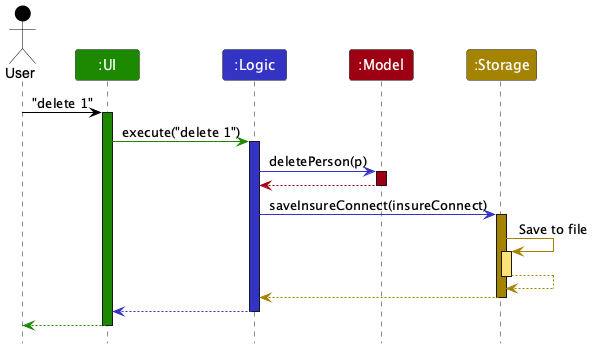

Each of the four main components (also shown in the diagram above),

* defines its *API* in an `interface` with the same name as the Component.
* provides its functionality through a concrete `{Component Name}Manager` class that implements the corresponding API interface.

For example, the `Logic` component defines its API in `Logic.java` and implements it in `LogicManager.java`. Other components interact with a component through its interface rather than its concrete class, preventing them from coupling to that component's implementation, as illustrated in the following partial class diagram.

The sections below give more details of each component.

### UI component

The **API** of this component is specified in [`Ui.java`](https://github.com/AY2627S1-CS2103T-W09-4/tp/tree/master/src/main/java/seedu/insureconnect/ui/Ui.java)

The UI consists of a `MainWindow` and its parts, such as `CommandBox`, `ResultDisplay`, `PersonListPanel`, and `StatusBarFooter`. All of these, including `MainWindow`, inherit from the abstract `UiPart` class, which captures common behavior among classes that represent visible GUI parts.

The `UI` component uses the JavaFX UI framework. The layouts of these UI parts are defined in matching `.fxml` files in `src/main/resources/view`. For example, [`MainWindow.fxml`](https://github.com/AY2627S1-CS2103T-W09-4/tp/tree/master/src/main/resources/view/MainWindow.fxml) specifies the layout of [`MainWindow`](https://github.com/AY2627S1-CS2103T-W09-4/tp/tree/master/src/main/java/seedu/insureconnect/ui/MainWindow.java).

The `UI` component,

* executes user commands using the `Logic` component.
* listens for changes to `Model` data so that the UI can be updated with the modified data.
* keeps a reference to the `Logic` component, because the `UI` relies on the `Logic` to execute commands.
* depends on some classes in the `Model` component because it displays `Person` objects from the model.

### Logic component

**API** : [`Logic.java`](https://github.com/AY2627S1-CS2103T-W09-4/tp/tree/master/src/main/java/seedu/insureconnect/logic/Logic.java)

Here's a (partial) class diagram of the `Logic` component:

The sequence diagram below illustrates the interactions within the `Logic` component, taking `execute("delete 1")` API call as an example.

:information_source: **Note:** The lifeline for `DeleteCommandParser` should end at the destroy marker (X), but due to a limitation of PlantUML, it continues to the end of the diagram.

How the `Logic` component works:

1. When `Logic` is called upon to execute a command, the command is passed to an `InsureConnectParser` object, which in turn creates a parser that matches the command (e.g., `DeleteCommandParser`) and uses it to parse the command.
1. This results in a `Command` object (more precisely, an object of one of its subclasses e.g., `DeleteCommand`) which is executed by the `LogicManager`.
1. The command can communicate with the `Model` when it is executed (e.g. to delete a person). 
   Note that although this is shown as a single step in the diagram above for simplicity, the code can require several interactions between the command object and the `Model` to complete the operation.
1. The result of the command execution is encapsulated as a `CommandResult` object which is returned from `Logic`.

Here are the other classes in `Logic` (omitted from the class diagram above) that are used for parsing a user command:

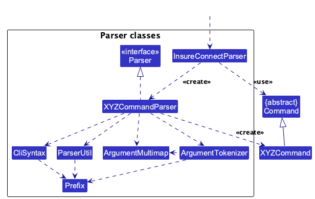

How the parsing works:
* When called upon to parse a user command, the `InsureConnectParser` class creates an `XYZCommandParser` (`XYZ` is a placeholder for the specific command name, e.g., `AddCommandParser`). The parser uses the other classes shown above to parse the user command and create an `XYZCommand` object (e.g., `AddCommand`). The `InsureConnectParser` returns that object as a `Command` object.
* All `XYZCommandParser` classes, such as `AddCommandParser` and `DeleteCommandParser`, implement the `Parser` interface so they can be treated similarly where appropriate, for example during testing.

### Model component
**API** : [`Model.java`](https://github.com/AY2627S1-CS2103T-W09-4/tp/tree/master/src/main/java/seedu/insureconnect/model/Model.java)

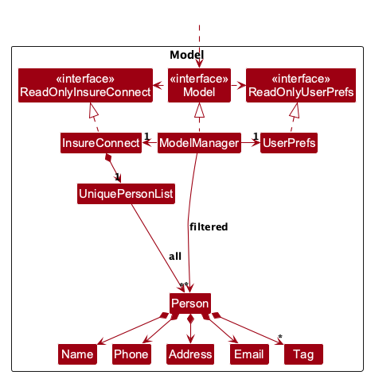

The `Model` component,

* stores InsureConnect data i.e., all `Person` objects (which are contained in a `UniquePersonList` object).
* stores the `Person` objects selected by the current filter, such as search results, in a separate _filtered_ list. It exposes this list as an unmodifiable `ObservableList<Person>` that the UI can observe and bind to, so the UI updates when the list changes.
* stores a `UserPrefs` object that represents the user’s preferences (currently, just the GUI settings). This is exposed to the outside as a `ReadOnlyUserPrefs` object.
* does not depend on any of the other three components (as the `Model` represents data entities of the domain, they should make sense on their own without depending on other components)

:information_source: **Note:** The alternative, arguably more object-oriented, design below keeps a unique list of tags in `InsureConnect`, and each `Person` references tags from that list. This lets `InsureConnect` maintain one `Tag` object per unique tag instead of each `Person` holding its own `Tag` objects. 

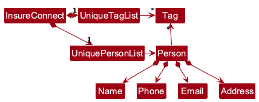

### Storage component

**API** : [`Storage.java`](https://github.com/AY2627S1-CS2103T-W09-4/tp/tree/master/src/main/java/seedu/insureconnect/storage/Storage.java)

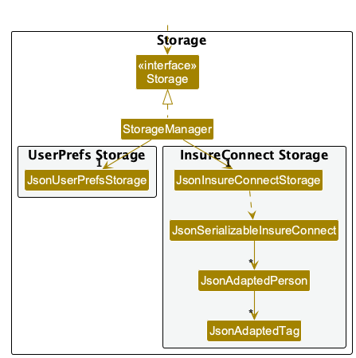

The `Storage` component,
* can save both InsureConnect data and user preference data in JSON format, and read them back into corresponding objects.
* is implemented by `StorageManager`, which delegates the actual JSON file access to `JsonInsureConnectStorage` and `JsonUserPrefsStorage` (one class per data file).
* depends on some classes in the `Model` component (because the `Storage` component's job is to save/retrieve objects that belong to the `Model`)

### Common classes

Classes used by multiple components are in the `seedu.insureconnect.commons` package.

--------------------------------------------------------------------------------------------------------------------

## **Implementation**

This section describes some noteworthy details on how certain features are implemented.

### \[Proposed\] Undo/redo feature

#### Proposed Implementation

The proposed undo/redo mechanism is facilitated by `VersionedInsureConnect`. It extends `InsureConnect` with an undo/redo history, stored internally as an `insureConnectStateList` and `currentStatePointer`. Additionally, it implements the following operations:

* `VersionedInsureConnect#commit()` — Saves the current InsureConnect state in its history.
* `VersionedInsureConnect#undo()` — Restores the previous InsureConnect state from its history.
* `VersionedInsureConnect#redo()` — Restores a previously undone InsureConnect state from its history.

These operations are exposed in the `Model` interface as `Model#commitInsureConnect()`, `Model#undoInsureConnect()` and `Model#redoInsureConnect()` respectively.

Given below is an example usage scenario and how the undo/redo mechanism behaves at each step.

Step 1. The user launches the application for the first time. The `VersionedInsureConnect` will be initialized with the initial InsureConnect state, and the `currentStatePointer` pointing to that single InsureConnect state.

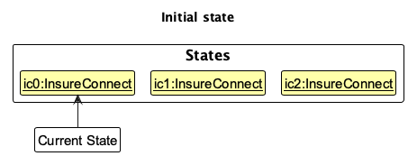

Step 2. The user executes `delete 5` command to delete the 5th person in InsureConnect. The `delete` command calls `Model#commitInsureConnect()`, causing the modified state of InsureConnect after the `delete 5` command executes to be saved in the `insureConnectStateList`, and the `currentStatePointer` is shifted to the newly inserted InsureConnect state.

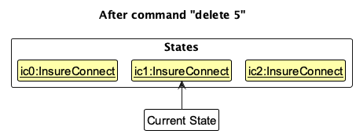

Step 3. The user executes `add n/David …​` to add a new person. The `add` command also calls `Model#commitInsureConnect()`, causing another modified InsureConnect state to be saved into the `insureConnectStateList`.

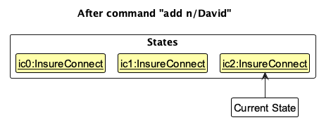

:information_source: **Note:** If a command fails its execution, it will not call `Model#commitInsureConnect()`, so InsureConnect state will not be saved into the `insureConnectStateList`.

Step 4. The user now decides that adding the person was a mistake, and decides to undo that action by executing the `undo` command. The `undo` command will call `Model#undoInsureConnect()`, which will shift the `currentStatePointer` once to the left, pointing it to the previous InsureConnect state, and restores InsureConnect to that state.

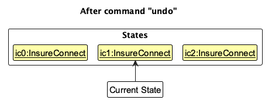

:information_source: **Note:** If the `currentStatePointer` is at index 0, pointing to the initial InsureConnect state, then there are no previous InsureConnect states to restore. The `undo` command uses `Model#canUndoInsureConnect()` to check if this is the case. If so, it will return an error to the user rather
than attempting to perform the undo.

The following sequence diagram shows how an undo operation goes through the `Logic` component:

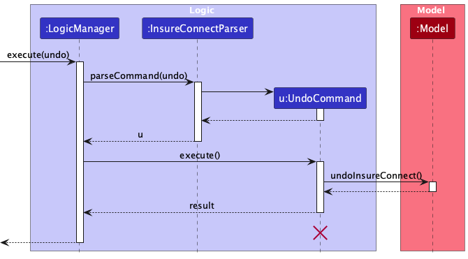

:information_source: **Note:** The lifeline for `UndoCommand` should end at the destroy marker (X), but due to a limitation of PlantUML, it continues to the end of the diagram.

Similarly, how an undo operation goes through the `Model` component is shown below:

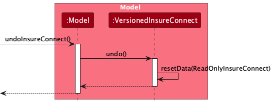

The `redo` command does the opposite — it calls `Model#redoInsureConnect()`, which shifts the `currentStatePointer` once to the right, pointing to the previously undone state, and restores InsureConnect to that state.

:information_source: **Note:** If the `currentStatePointer` is at index `insureConnectStateList.size() - 1`, pointing to the latest InsureConnect state, then there are no undone InsureConnect states to restore. The `redo` command uses `Model#canRedoInsureConnect()` to check if this is the case. If so, it will return an error to the user rather than attempting to perform the redo.

Step 5. The user then decides to execute the command `list`. Commands that do not modify InsureConnect, such as `list`, will usually not call `Model#commitInsureConnect()`, `Model#undoInsureConnect()` or `Model#redoInsureConnect()`. Thus, the `insureConnectStateList` remains unchanged.

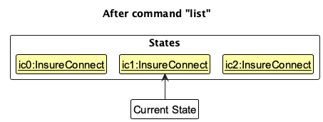

Step 6. The user executes `clear`, which calls `Model#commitInsureConnect()`. Since the `currentStatePointer` is not pointing at the end of the `insureConnectStateList`, all InsureConnect states after the `currentStatePointer` will be purged. Reason: It no longer makes sense to redo the `add n/David …​` command. This is the behavior that most modern desktop applications follow.

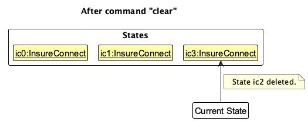

The following activity diagram summarizes what happens when a user executes a new command:

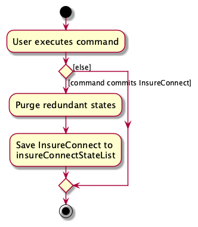

#### Design considerations:

**Aspect: How undo & redo execute:**

* **Alternative 1 (current choice):** Saves the entire InsureConnect.
  * Pros: Easy to implement.
  * Cons: May have performance issues in terms of memory usage.

* **Alternative 2:** Individual command knows how to undo/redo by
  itself.
  * Pros: Will use less memory (e.g. for `delete`, just save the person being deleted).
  * Cons: We must ensure that the implementation of each individual command is correct.

_{more aspects and alternatives to be added}_

### \[Proposed\] Data archiving

_{Explain here how the data archiving feature will be implemented}_

--------------------------------------------------------------------------------------------------------------------

## **Documentation, logging, testing, dev-ops**

* [Documentation guide](Documentation.md)
* [Testing guide](Testing.md)
* [Logging guide](Logging.md)
* [DevOps guide](DevOps.md)

--------------------------------------------------------------------------------------------------------------------

## **Appendix: Requirements**

### Product scope

**Target user profile**:

* is an insurance agent (or financial adviser) based in Singapore
* manages a large portfolio of customers (up to about 1000), each holding one or more insurance policies
* handles many policies, claims, renewals and follow-ups daily
* needs to pull up a customer's contact details and policies quickly, for example while the customer is on the line
* finds it hard to remember customers' policy numbers, but remembers their names
* does most of their administrative work on a laptop or desktop computer
* can type fast and prefers typing to mouse interactions
* is reasonably comfortable using CLI apps

**Value proposition**: InsureConnect gives an insurance agent fast access to customer contact and policy details through typed commands, so that a customer can be found by name instead of by a policy number that is hard to remember. It is faster than a spreadsheet or a mouse-driven CRM, keeps all data on the agent's own computer and works without an internet connection.
>>>>>>> Stashed changes

### User stories

Priorities: High (must have) - `* * *`, Medium (nice to have) - `* *`, Low (unlikely to have) - `*`

| Priority | Story | As an …​                          | I want to …​                                                | So that I can…​                                              |
|--------|-------|-----------------------------------|-------------------------------------------------------------|--------------------------------------------------------------|
| `* * *` | US01  | insurance agent (regular user)    | add a customer record                                       | track customer contact information in the system             |
| `* *`  | US02  | insurance agent (first time user) | view a help guide                                           | learn the available commands                                 |
| `* * *` | US03  | insurance agent (regular user)    | search for a customer by name                               | quickly find the customer's record                           |
| `* *`  | US04  | insurance agent (beginner user)   | search for a customer by customer ID                        | retrieve the correct record efficiently                      |
| `* *`  | US05  | insurance agent (beginner user)   | search for a customer by phone number                       | identify the customer using information they provide         |
| `* *`  | US06  | insurance agent (beginner user)   | search for a policy by policy number                        | immediately retrieve its details                             |
| `* *`  | US07  | insurance agent (beginner user)   | view all policies belonging to a customer                   | understand the customer's insurance coverage                 |
| `* *`  | US08  | insurance agent (beginner user)   | view detailed information about a policy                    | answer customer enquiries                                    |
| `* *`  | US09  | insurance agent (beginner user)   | add notes to a customer record                              | keep track of previous interactions                          |
| `* *`  | US10  | insurance agent (beginner user)   | update customer contact information                         | keep records accurate                                        |
| `* *`  | US11  | insurance agent (beginner user)   | create a follow-up task                                     | not forget required actions                                  |
| `* * ` | US12  | insurance agent (beginner user)   | specify a due date for a follow-up task                     | know when it needs to be completed                           |
| `* *`  | US13  | insurance agent (beginner user)   | view outstanding tasks                                      | know what work remains                                       |
| `* *`  | US14  | insurance agent  (regular user)   | view overdue tasks                                          | prioritise missed follow-ups                                 |
| `* *`  | US15  | insurance agent (regular user)    | mark tasks as completed                                     | keep my task list up to date                                 |
| `* *`  | US16  | insurance agent (regular user)    | view policies approaching renewal                           | follow up with customers in time                             |
| `* *`  | US17  | insurance agent  (regular user)   | filter policies by status                                   | focus on relevant records                                    |
| `* *`  | US18  | insurance agent  (regular user)   | filter policies by renewal date                             | identify policies requiring attention soon                   |
| `* *`  | US19  | insurance agent with many clients | filter and sort large lists                                 | quickly locate relevant information                          |
| `*`    | US20  | insurance agent (regular user)    | use command autocomplete                                    | enter commands faster and avoid syntax errors                |
| `* *`  | US22  | insurance agent (regular user)    | navigate between related customer and policy records        | handle enquiries efficiently                                 |
| `*`    | US21  | insurance agent  (regular user)   | access command history                                      | quickly repeat frequently used commands                      |
| `*`    | US23  | insurance agent (expert user)     | perform batch operations                                    | process multiple records efficiently                         |
| `*`    | US24  | insurance agent   (expert user)   | archive old or completed records                            | prevent unnecessary information from cluttering my workspace |
| `* * *` | US25  | insurance agent  (regular user)   | delete customer or policy records that are no longer needed | keep the system organised                                    |
| `* *`  | US26  | insurance agent (expert user)     | receive confirmation before destructive operations          | avoid accidentally removing important information            |
| `* *`  | US27  | insurance agent (regular user)    | receive clear success and error messages                    | know whether my command was executed correctly               |
| `* *`  | US28  | insurance agent  (regular user)   | view upcoming tasks and renewals at the start of my shift   | plan my workload                                             |
| `*`    | US29  | insurance agent (expert user)     | review remaining tasks before ending my shift               | avoid forgetting important work                              |
| `* * *` | US30  | insurance agent  (regular user)   | list all records in the system                              | view all records at once                                     |
| `* * *` | US31  | insurance agent  (regular user)   | edit all records in the system                              | avoid deleting and creating a new record                     |

### Use cases

(For all use cases below, the **System** is `InsureConnect` and the **Actor** is the `agent`, unless specified otherwise)

**Use case: UC01 - Add a customer**

**MSS**

1.  Agent requests to add a customer, providing the customer's details.
2.  InsureConnect adds the customer and shows the details of the added customer.

    Use case ends.

**Extensions**

* 1a. A compulsory detail (name, phone, email, address or at least one policy number) is missing.

    * 1a1. InsureConnect shows an error message stating the expected format.

      Use case resumes at step 1.

* 1b. A detail is in an invalid format (e.g. the phone number contains letters).

    * 1b1. InsureConnect shows an error message stating which detail is invalid and what values are accepted.

      Use case resumes at step 1.

* 1c. A customer with the same name and phone number already exists.

    * 1c1. InsureConnect informs the agent that the customer already exists and does not add the customer.

      Use case ends.

* 1d. A given policy number already belongs to an existing customer.

    * 1d1. InsureConnect informs the agent which customer the policy number belongs to and does not add the customer.

      Use case resumes at step 1.

**Use case: UC02 - Find a customer**

**MSS**

1.  Agent requests to find customers, providing one or more keywords.
2.  InsureConnect shows the customers who have a word in their name starting with any of the keywords, together with the number of matches.

    Use case ends.

**Extensions**

* 1a. No keyword is given.

    * 1a1. InsureConnect shows an error message stating the expected format.

      Use case resumes at step 1.

* 2a. No customer matches the keywords.

    * 2a1. InsureConnect shows an empty list and informs the agent that 0 customers were found.

      Use case ends.

**Use case: UC03 - Delete a customer**

**MSS**

1.  Agent <u>finds the customer (UC02)</u>.
2.  Agent requests to delete a specific customer in the displayed list.
3.  InsureConnect deletes the customer and shows the details of the deleted customer.

    Use case ends.

**Extensions**

* 1a. The customer is not found.

  Use case ends.

* 2a. The given index is invalid.

    * 2a1. InsureConnect shows an error message.

      Use case resumes at step 2.

**Use case: UC04 - Edit a customer's details**

**MSS**

1.  Agent <u>finds the customer (UC02)</u>.
2.  Agent requests to edit a specific customer in the displayed list, providing the new details.
3.  InsureConnect updates the customer and shows the updated details.

    Use case ends.

**Extensions**

* 1a. The customer is not found.

  Use case ends.

* 2a. The given index is invalid.

    * 2a1. InsureConnect shows an error message.

      Use case resumes at step 2.

* 2b. No new details are given, or a new detail is in an invalid format.

    * 2b1. InsureConnect shows an error message stating which detail is missing or invalid.

      Use case resumes at step 2.

* 2c. The edit would make the customer a duplicate of another existing customer, or a new policy number already belongs to another customer.

    * 2c1. InsureConnect informs the agent that the customer already exists and does not apply the edit.

      Use case ends.

**Use case: UC05 - Start the app with an unreadable data file**

**MSS**

1.  Agent launches InsureConnect.
2.  InsureConnect detects that the data file cannot be read and warns the agent that the existing data was not loaded.
3.  InsureConnect starts with an empty customer list and leaves the existing data file untouched.
4.  Agent closes InsureConnect and repairs or replaces the data file.

    Use case ends.

**Extensions**

* 2a. The data file does not exist.

    * 2a1. InsureConnect starts without showing a warning and creates a new data file when the first change is saved.

      Use case ends.

* 3a. Agent makes a change to the customer list before closing InsureConnect.

    * 3a1. InsureConnect does not overwrite the unreadable data file and warns the agent that the change was not saved.

      Use case resumes at step 4.

### Non-Functional Requirements

1.  Should work on any _mainstream OS_ as long as it has Java `25` or above installed.
2.  Should be able to hold up to 1000 customers without noticeable sluggishness in performance for typical usage.
3.  Should respond to any command within 2 seconds when holding up to 1000 customers.
4.  A user with above average typing speed for regular English text (i.e. not code, not system admin commands) should be able to accomplish most of the tasks faster using commands than using the mouse.
5.  Should be usable by a single user only; data is not shared between users or computers.
6.  Should store data locally in a human editable text file, so that an advanced user can inspect and correct the data without the app.
7.  Should not depend on a database management system or a remote server, and should work fully without an internet connection.
8.  Should save data to the hard disk after every command that changes data, so that no change is lost if the app is closed unexpectedly. If a save fails, the user should be told so in the result of that same command.
9.  Should never overwrite an existing data file that it failed to read.
10. Should be packaged as a single JAR file of no more than 100MB that runs without an installer.
11. The GUI should work well (i.e. no resolution related inconvenience) for screen resolutions 1920x1080 and higher, and screen scales 100% and 125%.
12. The GUI should remain usable (i.e. all functions can be used even if the experience is not optimal) for screen resolutions 1280x720 and higher, and screen scales 150%.
13. Every error message for an invalid command should state the expected command format or the accepted values, so that the user can correct the command without consulting the User Guide.

### Glossary

* **Mainstream OS**: Windows, Linux, Unix, or macOS
* **Agent**: An insurance agent or financial adviser who sells insurance policies and uses InsureConnect to manage their customers
* **Customer**: A person whose details are recorded in InsureConnect, who holds at least one insurance policy sold by the agent
* **Policy**: An insurance contract held by a customer, such as a life, health, motor or travel insurance plan
* **Policy number**: The unique code that identifies a policy, made up of 1 to 30 letters and digits (e.g. `LIFE20481`). Every customer has at least one, and no two customers can share the same policy number. Entered with the `t/` prefix
* **Remark**: A free text note attached to a customer, used for follow-ups and preferences (e.g. `Prefers WhatsApp after 6pm`)
* **Duplicate customer**: A customer whose name (ignoring case and extra spaces) and phone number are both identical to those of an existing customer. Two customers with the same name but different phone numbers are not duplicates
* **Prefix matching**: The way `find` compares keywords with names: a keyword matches a name if any word in the name starts with the keyword, ignoring case (e.g. `wei` matches `Tan Wei Ming`, but `ei` does not)
* **Index**: The position number of a customer in the currently displayed list, used to identify the customer in commands such as `delete`. Indices start from 1 and change when the list is filtered by `find` or a customer is deleted
* **Prefix**: The short marker that comes before a value in a command, such as `n/` for name or `p/` for phone
* **Data file**: The JSON file in which InsureConnect stores all customer records on the user's computer
* **MSS**: Main Success Scenario, the most common sequence of steps in a use case when nothing goes wrong

--------------------------------------------------------------------------------------------------------------------

## **Appendix: Instructions for manual testing**

Given below are instructions to test the app manually.

:information_source: **Note:** These instructions only provide a starting point for testers to work on;
testers are expected to do more *exploratory* testing.

### Launch and shutdown

1. Initial launch

   1. Download the JAR file and copy it into an empty folder.

   1. Double-click the JAR file. 
      Expected: The GUI opens with a set of sample contacts. The window size may not be optimal.

1. Saving window preferences

   1. Resize the window to an optimal size. Move the window to a different location. Close the window.

   1. Relaunch the app by double-clicking the JAR file. 
       Expected: The most recent window size and location are retained.

1. _{ more test cases …​ }_

### Deleting a person

1. Deleting a person while all persons are being shown

   1. Prerequisites: List all persons using the `list` command, with multiple persons in the list.

   1. Test case: `delete 1` 
      Expected: The first contact is deleted from the list. The status message shows the deleted contact's details.

   1. Test case: `delete 0` 
      Expected: No person is deleted. The status message shows error details.

   1. Other incorrect delete commands to try: `delete`, `delete x`, `...` (where x is larger than the list size) 
      Expected: Similar to previous.

1. _{ more test cases …​ }_

### Saving data

1. Dealing with missing/corrupted data files

   1. _{Explain how to simulate missing or corrupted data files and state the expected behavior.}_

1. _{ more test cases …​ }_
